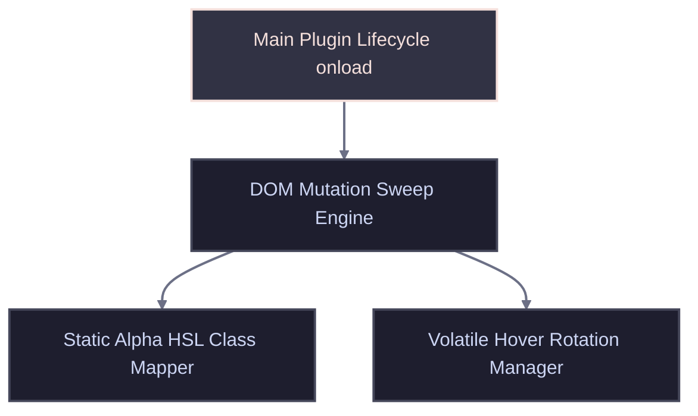

<!-- # TEMPLATE: MANUAL.template.md -->
<!-- markdownlint-disable MD013 -->

# MANUAL

<!-- TOC location -->
## 🔍 Table of Contents
<!-- Maintained by script -->
- [MANUAL](#a-manual)  ^toc-manual
  - [📑 AI Primary Files](#a-aiprimaryfiles)  ^toc-aiprimaryfiles
  - [📥 Installation & Initial Deployment](#a-installationinitialdeployment)  ^toc-installationinitialdeployment
    - [Setup Sequence](#a-setupsequence)  ^toc-setupsequence
  - [🏗️ 1. Architecture Overview](#a-1architectureoverview)  ^toc-1architectureoverview
  - [🧠 2. Core Modules & Systems](#a-2coremodulessystems)  ^toc-2coremodulessystems
  - [🔎 3. Core Algorithm & Mathematical Formulas](#a-3corealgorithmmathematicalformulas)  ^toc-3corealgorithmmathematicalformulas
  - [🛰️ 4. Commands, Keybindings & Context Flags](#a-4commandskeybindingscontextflags)  ^toc-4commandskeybindingscontextflags
  - [🔧 5. Workspace Build & Configuration](#a-5workspacebuildconfiguration)  ^toc-5workspacebuildconfiguration
  - [🔍 Diagnostics & Common Troubleshooting](#a-diagnosticscommontroubleshooting)  ^toc-diagnosticscommontroubleshooting
    - [Known Failure States & Remediations](#a-knownfailurestatesremediations)  ^toc-knownfailurestatesremediations
      - [🚨 Symptom: "Links drop out of text alignment lines or snap text blocks abnormally"](#a-symptomlinksdropoutoftextalignmentlinesorsnaptextblocksabnormally)  ^toc-symptomlinksdropoutoftextalignmentlinesorsnaptextblocksabnormally
      - [🚨 Symptom: "Cursor jumps or characters flash briefly while modifying a link label string"](#a-symptomcursorjumpsorcharactersflashbrieflywhilemodifyingalinklabelstring)  ^toc-symptomcursorjumpsorcharactersflashbrieflywhilemodifyingalinklabelstring
  - [🚀 Go to...](#a-goto)  ^toc-goto

[TOC](#toc-manual)

## 📑 AI Primary Files
[TOC](#toc-aiprimaryfiles)

- 🔹 [AGENTS.md](../AGENTS.md)
- 🔹 [ARCHIVE.md](ARCHIVE.md)
- 🔹 [BUILD.md](BUILD.md)
- 🔹 [CODE.md](CODE.md)
- 🔹 [DESIGN.md](DESIGN.md)
- 🔹 [FEATURES.md](FEATURES.md)
- 🔹 [LOG.md](LOG.md)
- 🔸 [MANUAL.md](MANUAL.md)
- 🔹 [README.md](../README.md)
- 🔹 [SPEC.md](SPEC.md)
- 🔹 [TASKS.md](TASKS.md)
- 🔹 [TERMS.md](TERMS.md)
- 🔹 [TESTING.md](TESTING.md)
- 🔹 [VERSIONS.md](VERSIONS.md)

---

---

## 📥 Installation & Initial Deployment
[TOC](#toc-installationinitialdeployment)

### Setup Sequence
[TOC](#toc-setupsequence)

- 1. **Compile/Build Assets:** Run `npm run build` to package runtime bundles as documented in [BUILD.md](BUILD.md).
- 2. **Apply Configurations:** Ensure the compiled folder sits under `.obsidian/plugins/op-links-alpha-hue/` in your local vault.
- 3. **Register Components:** Access Obsidian's Community Plugins settings panel, reload the local index, and activate the toggle link switch.

---

## 🏗️ 1. Architecture Overview
[TOC](#toc-1architectureoverview)

The plugin leverages an asynchronous observer model that hooks into Obsidian's workspace leaves. It intercepts rendered tokens across live text windows and reading containers, mapping elements to a hardware-accelerated presentation layer without causing caret or scroll repositioning.

---

## 🧠 2. Core Modules & Systems
[TOC](#toc-2coremodulessystems)

- **`LinkSpectrumPlugin`**: Core lifecycle initializer. Manages loading routines, workspace layout mutation event bindings, settings mappings, and structural unloads.
- **`MutationObserver Loop`**: Viewport interceptor tracking raw modifications to the body node tree to apply style states instantly when a link enters view.
- **`activeAnimationIntervals`**: Volatile memory ledger mapping live DOM node memory references to running `setInterval` pointer identifiers to bypass orphaned leaks.
- **`boundMouseHandlers`**: Event storage array tracking strict closure mappings for `mouseenter` and `mouseleave` triggers to guarantee pristine garbage collection.

---

## 🔎 3. Core Algorithm & Mathematical Formulas
[TOC](#toc-3corealgorithmmathematicalformulas)

The plugin spaces the 26-character English alphabet array evenly across a circular 360-degree cylindrical spectrum map using the following HSL index formula:

$$\text{Hue} = \text{round}\left( \frac{i}{26} \times 360 \right)$$

where $i \in [0, 25]$ represents the alphabetical character sequence offset ($a = 0, b = 1, \dots, z = 25$).

- **Step 1:** Intercept the text payload of a link element and extract the first character.
- **Step 2:** Convert character string token down to lower case and validate against base alphabet constraints.
- **Step 3:** Assign the target calculated configuration string `.cm-spectrum-{char}` directly into the element's token list map.

---

## 🛰️ 4. Commands, Keybindings & Context Flags
[TOC](#toc-4commandskeybindingscontextflags)

- **`layout-change`**:
  - **Type:** Core Workspace Hook
  - **Trigger:** Fires when rearranging pane splits or closing active notes.
- **`active-leaf-change`**:
  - **Type:** Core View Hook
  - **Trigger:** Triggers when jumping focal interaction between adjacent file tabs.
- **`mouseenter`**:
  - **Type:** Hardware Interaction Flag
  - **Trigger:** Initiates live HSL rotation loop and sets inline property tags to override static rules.

---

## 🔧 5. Workspace Build & Configuration
[TOC](#toc-5workspacebuildconfiguration)

- **`manifest.json`:**
  - **Target Version:** `1.0.1`
  - **Purpose:** Declares metadata constraints to register safely inside Obsidian’s core system engine.
  - **Format:** JSON structure.
- **`styles.css`:**
  - **Target Version:** Embedded production sheet
  - **Purpose:** Applies structural overrides that force link tokens to behave as `inline-block` matrices.
  - **Format:** Hardware-accelerated CSS.

---

## 🔍 Diagnostics & Common Troubleshooting
[TOC](#toc-diagnosticscommontroubleshooting)

### Known Failure States & Remediations
[TOC](#toc-knownfailurestatesremediations)

#### 🚨 Symptom: "Links drop out of text alignment lines or snap text blocks abnormally"
[TOC](#toc-symptomlinksdropoutoftextalignmentlinesorsnaptextblocksabnormally)
- **Root Cause:** In certain third-party themes, forcing elements to `inline-block` causes formatting bugs inside tight lists.
- **Remediation:** Adjust your custom snippets to change `display: inline-block` declarations down to `display: inline` and switch to a 2D matrix transition.

#### 🚨 Symptom: "Cursor jumps or characters flash briefly while modifying a link label string"
[TOC](#toc-symptomcursorjumpsorcharactersflashbrieflywhilemodifyingalinklabelstring)
- **Root Cause:** Intercepting class chains using bulk regex strings breaks the active CodeMirror syntax tree leaf layout state.
- **Remediation:** Verify you are using the updated `classList.add` token mutations introduced in production hotfix bundle v1.0.1.

---

## 🚀 Go to...
[TOC](#toc-goto)

- 🔹 [AGENTS.md](../AGENTS.md)
- 🔹 [ARCHIVE.md](ARCHIVE.md)
- 🔹 [BUILD.md](BUILD.md)
- 🔹 [CODE.md](CODE.md)
- 🔹 [DESIGN.md](DESIGN.md)
- 🔹 [FEATURES.md](FEATURES.md)
- 🔹 [LOG.md](LOG.md)
- 🔸 [MANUAL.md](MANUAL.md)
- 🔹 [README.md](../README.md)
- 🔹 [SPEC.md](SPEC.md)
- 🔹 [TASKS.md](TASKS.md)
- 🔹 [TERMS.md](TERMS.md)
- 🔹 [TESTING.md](TESTING.md)
- 🔹 [VERSIONS.md](VERSIONS.md)

<!-- TEMPLATE: MANUAL.template.md -->
